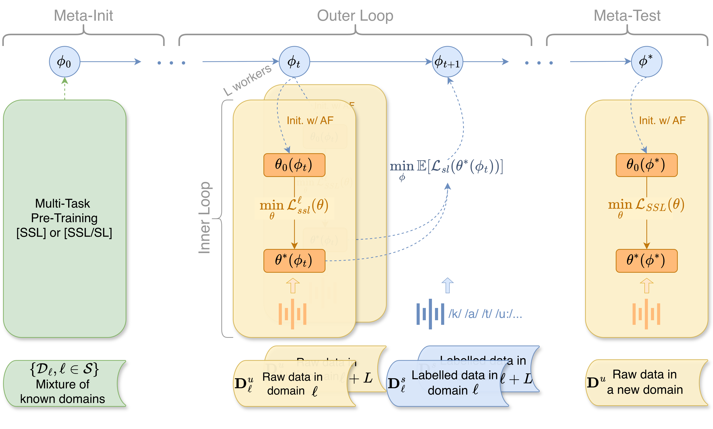

# SpidR-Adapt: A Universal Speech Representation Model for Few-Shot Adaptation

<a href="https://pytorch.org/get-started/locally/"></a>
<a href="https://arxiv.org/"></a>

---

This repository contains research code and checkpoints for **SpidR-Adapt**.

<p align="center">
  
</p>

## Overview

SpidR-Adapt enables rapid adaptation to new languages using minimal unlabeled data. The pipeline consists of three main phases:

1. **Meta-Init Stage**: Multi-task pre-training with interleaved supervision, learning a robust meta-initialization $\mathbf{\phi}_0$ from a mixture of known domains.
2. **Meta-Training (MAdaPT-FOBLO)**: Further optimizes initialization across multiple domains. Each worker performs inner-loop adaptation with active forgetting (AF) on raw, unlabeled data, followed by outer-loop updates that refine $\mathbf{\phi}$ by minimizing expected task loss on labeled data. This bi-level optimization yields a meta-learner optimized for rapid adaptation.
3. **Meta-Test**: The learned $\mathbf{\phi}^*$ quickly adapts to a new, unseen domain using only its raw data. Each domain corresponds to a single language.

SpidR-Adapt achieves rapid gains in phonemic discriminability (ABX) and spoken language modeling (sWUGGY, sBLIMP, tSC), outperforming in-domain language models after training on less than 1 hour of target-language audio—over **100× more data-efficient** than standard training.

---

## Installation

We recommend using [uv](https://docs.astral.sh/uv/#getting-started):

```bash
uv sync
```

Alternatively, use **conda** (also works for mamba/micromamba):

```bash
conda create -n spidr-adapt python=3.12 -c conda-forge
conda activate spidr-adapt
uv pip install -e . --group dev
```

Or standard **pip**:

```bash
python3 -m venv .venv
source .venv/bin/activate
pip install -e . --group dev
```

**Note:** FFmpeg is required for torchcodec audio loading. FFmpeg7 is recommended; FFmpeg4/8 may be incompatible. Check your version with `ffmpeg -version`. If missing or incorrect, install via:

```bash
conda install ffmpeg=7.0.0 -c conda-forge
```

---

## Usage

### 1. Data Preparation

See [these instructions](https://github.com/facebookresearch/spidr-adapt/tree/main/datasets) for dataset preperation.

### 2. Pretraining

- Create a TOML config file for pretraining (see `src/spidr/config.py` for available fields).
- Start from `configs/multitask_pt_ssl.toml` or `configs/multitask_pt_sl.toml` (specifies required fields).

You will obtain two meta-initializations:
- [`Multi-Task-PT[SSL]`](https://dl.fbaipublicfiles.com/shared/devai/assets/models/): Standard multi-task pretraining (self-supervised loss).
- [`Multi-Task-PT[SSL/SL]`](https://dl.fbaipublicfiles.com/shared/devai/assets/models/): Interleaved supervised loss in self-supervised training.

Both are pretrained on VP19 languages (excluding target languages).

### 3. Meta-Training

Launch two implementations of MAdapt: **Reptile** and **FOBLO** with different meta-initializations by setting `init_ckpt` in configs, or use:

- `configs/*_ssl.toml`
- `configs/*_ssl+sl.toml`

Utilities are provided for SLURM clusters. Training and validation are separate jobs.

**Example:**

```bash
python -m spidr_adapt --help
```

**Key options:**
- `-A ACCOUNT` (SLURM account)
- `-N NODES` (number of nodes)
- `-G GPUS_PER_NODE` (GPUs per node)
- `-c CPUS_PER_TASK` (CPUs per task)
- `--mem-per-gpu MEM_PER_GPU`
- `-t TIME` (time limit)
- `-C CONSTRAINT` (SLURM constraint)
- `-q QOS` (SLURM qos)
- `--dump DUMP` (Submitit dump)
- `configs [configs ...]` (TOML config files)

#### Meta-Train Checkpoints

| Method                      | Avg ABX Score w/o 0h (↓) | Checkpoints |
|-----------------------------|--------------------------|-------------|
| Multi-Task-PT [SSL]         | 4.33                     | [link](https://dl.fbaipublicfiles.com/shared/devai/assets/spidr-adapt/checkpoints/spidr_vp19lang/step_400000.pt)        |
| &nbsp;&nbsp;&nbsp;&nbsp;&nbsp;&nbsp;+MAdaPT-Reptile             | 4.19                     | [link](https://dl.fbaipublicfiles.com/shared/devai/assets/spidr-adapt/checkpoints/spidr_reptile_vp19lang/step_200000.pt)       |
| &nbsp;&nbsp;&nbsp;&nbsp;&nbsp;&nbsp;+MAdaPT-FOBLO               | 4.01                     | [link](https://dl.fbaipublicfiles.com/shared/devai/assets/spidr-adapt/checkpoints/spidr_foblo_vp19lang/step_200000.pt) |
| Multi-Task-PT [SSL/SL]      | 3.88                     | [link](https://dl.fbaipublicfiles.com/shared/devai/assets/spidr-adapt/checkpoints/spidr_sl_vp19lang/step_400000.pt)        |
| &nbsp;&nbsp;&nbsp;&nbsp;&nbsp;&nbsp;+MAdaPT-Reptile             | **3.76**                 | [link](https://dl.fbaipublicfiles.com/shared/devai/assets/spidr-adapt/checkpoints/spidr_reptile_sl_vp19lang/step_200000.pt)       |
| &nbsp;&nbsp;&nbsp;&nbsp;&nbsp;&nbsp;+MAdaPT-FOBLO               | <u>3.80</u>                    | [link](https://dl.fbaipublicfiles.com/shared/devai/assets/spidr-adapt/checkpoints/spidr_foblo_sl_vp19lang/step_200000.pt)        |

### 4. Fast Adaptive Fine-Tuning

- Use the last meta-training checkpoint as initialization (`init_ckpt` in `configs/finetuning.toml`).
- For fast fine-tuning to OoD target languages, use a single GPU.
- Evaluate each model variant (Multi-Task-PT, MAdaPT-Reptile, MAdaPT-FOBLO with SSL or SSL/SL) with various adaptation dataset sizes (10 min to 100 hours).

```bash
python src/spidr_adapt/finetuning.py ~configs/finetuning.toml
```

---

## License

The source code and model checkpoints are provided under the **CC BY-NC 4.0 License**.
